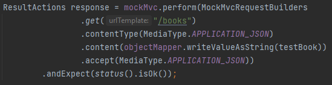

= Useful links

== endpoint testing & integration testing

https://howtodoinjava.com/spring-boot2/testing/spring-boot-mockmvc-example/
https://spring.io/guides/gs/testing-web/
https://www.youtube.com/watch?v=tG-TwkIhjOk
https://spring.io/blog/2014/12/02/latest-jackson-integration-improvements-in-spring
https://assertj.github.io/doc/
https://www.baeldung.com/spring-mvc-set-json-content-type
https://stackoverflow.com/questions/62022071/how-to-check-values-in-response-body-with-mockmvc-assertionerror-status-expec

Can be used also: @ExtendWith(SpringExtension.class)

Get ResultAction:

https://stackoverflow.com/questions/21495296/spring-mvc-controller-test-print-the-result-json-string

String content = result.getResponse().getContentAsString();

String content = String.valueOf(response.andReturn().getResponse().toString());

resultActions.andDo(MockMvcResultHandlers.print());

How to compare recursively ignoring given fields using assertJ?

https://stackoverflow.com/questions/43316133/how-to-compare-recursively-ignoring-given-fields-using-assertj

Checking response:

then(response)
    .usingRecursiveComparison()
    .ignoringExpectedNullFields()
    .ignoringFields("id")
    .isEqualTo(testBook);

https://www.javatpoint.com/java-string-format

https://www.baeldung.com/java-string-formatting-named-placeholders

https://github.com/assertj/assertj